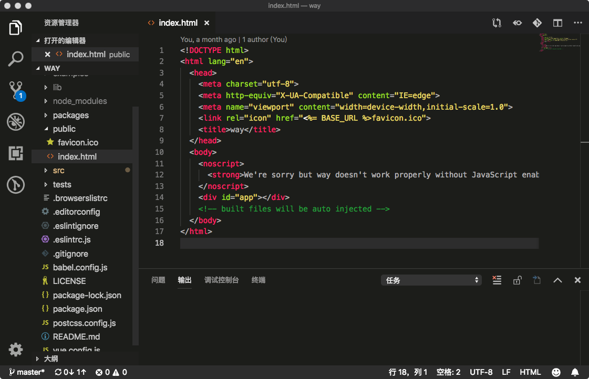
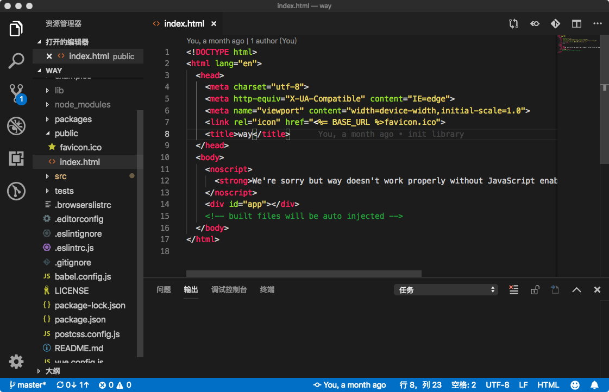

# Monokai VSCode Dark

Monokai Themes for VSCode Dark Mode

## Install

- [VSCode Marketplace](https://marketplace.visualstudio.com/items?itemName=waycowei.monokai-vscode-dark)

- Search `monokai-vscode-dark` or `Monokai VSCode Dark` in VSCode

## Themes

- Monokai Dark

- Monokai Dark Visual Studio

## Preview

> Screenshot for `Monokai VSCode Dark` theme

#### Monokai Dark

---

#### Monokai Dark Visual Studio

---

---

enjoy;)!!!