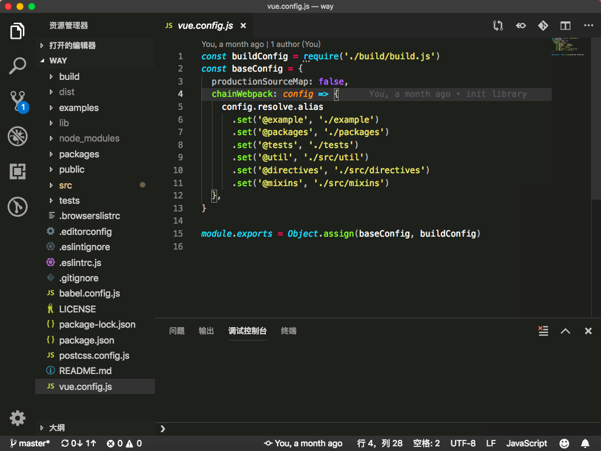

# Monokai VSCode Dark

A Monokai Theme for VSCode Dark Mode

## Install

- [VSCode Marketplace](https://marketplace.visualstudio.com/items?itemName=waycowei.monokai-vscode-dark)

- Search `monokai-vscode-dark` or `Monokai VSCode Dark` in VSCode

## Preview
> Screenshot for `Monokai VSCode Dark` theme
---

---

---

enjoy;)!!!